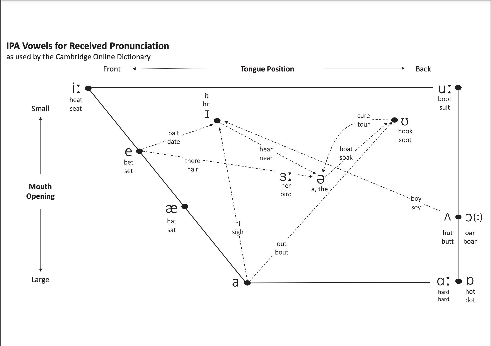

以下内容口音部分多为 RP - Received Pronunciation
> 小编非专业人士甚至没考四级，纯兴趣。如有错误，欢迎指正！

## 【节奏】

### [1.重音等时](https://en.wikipedia.org/wiki/Isochrony#Syllable_timing)(**stress timing**)

> 句子中重音间的时间间隔近乎相同

而中文则是音节等时(**syllable timing**)，由此一字一停造就了中式英语，需优先纠正。

尝试以相同的停顿时长读以下句子:

|       1秒       |       1秒       |    1秒    |
| :-------------: | :-------------: | :-------: |
|      dogs       |      chase      |   cats    |
|    the dogs     |      chase      | the casts |
| the clever dogs | will be chasing | the cats  |

## 【发音】

> 这是一个重灾区，从小学的多少有点大问题，建议每日朗读

如果你还不知道怎么读，可以看下 [https://englishwithlucy.co.uk/phonemic-chart/](https://englishwithlucy.co.uk/phonemic-chart/)

### [1.发音方式]

> 除了图中的颜色标记，部分元音的发生还需注意口型

然后如果你也不知道怎么确定口型，可以看下 [https://www.britishaccentacademy.com/interactive-ipa-chart/](https://www.britishaccentacademy.com/interactive-ipa-chart/)

